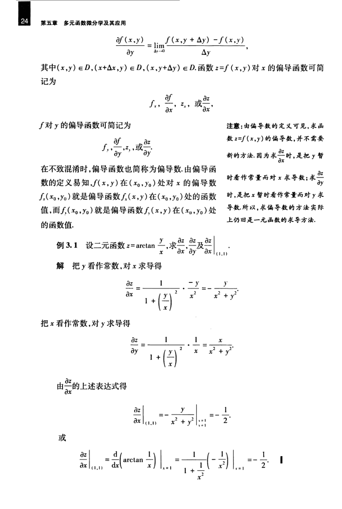

# 工科数学分析基础 下册 - Page 33

- 源文件：`temp/math/工科数学分析基础 下册.pdf`
- PDF 页码：33
- 教材页码：24
- 目录位置：第五章 / 第三节 / 3.1 偏导数
- 页图：`temp/math/visual-latex/工科数学分析基础 下册/pages/page-0033.png`
- 转写方式：视觉阅读 + LaTeX 手工整理
- 状态：已转写

## LaTeX Markdown

$$
\frac{\partial f(x,y)}{\partial y}
=\lim_{\Delta y\to 0}\frac{f(x,y+\Delta y)-f(x,y)}{\Delta y},
$$

其中 $(x,y)\in D$，$(x+\Delta x,y)\in D$，$(x,y+\Delta y)\in D$。函数 $z=f(x,y)$ 对 $x$ 的偏导函数可简记为

$$
f_x,\quad \frac{\partial f}{\partial x},\quad z_x,\quad \text{或}\quad \frac{\partial z}{\partial x};
$$

$f$ 对 $y$ 的偏导函数可简记为

$$
f_y,\quad \frac{\partial f}{\partial y},\quad z_y,\quad \text{或}\quad \frac{\partial z}{\partial y}.
$$

在不致混淆时，偏导函数也简称为偏导数。由偏导函数的定义易知，$f(x,y)$ 在 $(x_0,y_0)$ 处对 $x$ 的偏导数 $f_x(x_0,y_0)$ 就是偏导函数 $f_x(x,y)$ 在 $(x_0,y_0)$ 处的函数值，而 $f_y(x_0,y_0)$ 就是偏导函数 $f_y(x,y)$ 在 $(x_0,y_0)$ 处的函数值。

**例 3.1** 设二元函数

$$
z=\arctan\frac yx,
$$

求

$$
\frac{\partial z}{\partial x},\qquad
\frac{\partial z}{\partial y}
\qquad\text{及}\qquad
\left.\frac{\partial z}{\partial x}\right|_{(1,1)}.
$$

**解** 把 $y$ 看作常数，对 $x$ 求导得

$$
\frac{\partial z}{\partial x}
=\frac1{1+\left(\frac yx\right)^2}\cdot\left(-\frac y{x^2}\right)
=-\frac{y}{x^2+y^2}.
$$

把 $x$ 看作常数，对 $y$ 求导得

$$
\frac{\partial z}{\partial y}
=\frac1{1+\left(\frac yx\right)^2}\cdot\frac1x
=\frac{x}{x^2+y^2}.
$$

由 $\dfrac{\partial z}{\partial x}$ 的上述表达式得

$$
\left.\frac{\partial z}{\partial x}\right|_{(1,1)}
=-\left.\frac{y}{x^2+y^2}\right|_{\substack{x=1\\y=1}}
=-\frac12.
$$

或

$$
\left.\frac{\partial z}{\partial x}\right|_{(1,1)}
=
\left.\frac{d}{dx}\left(\arctan\frac1x\right)\right|_{x=1}
=\left.
\frac1{1+\frac1{x^2}}\left(-\frac1{x^2}\right)
\right|_{x=1}
=-\frac12.
$$
