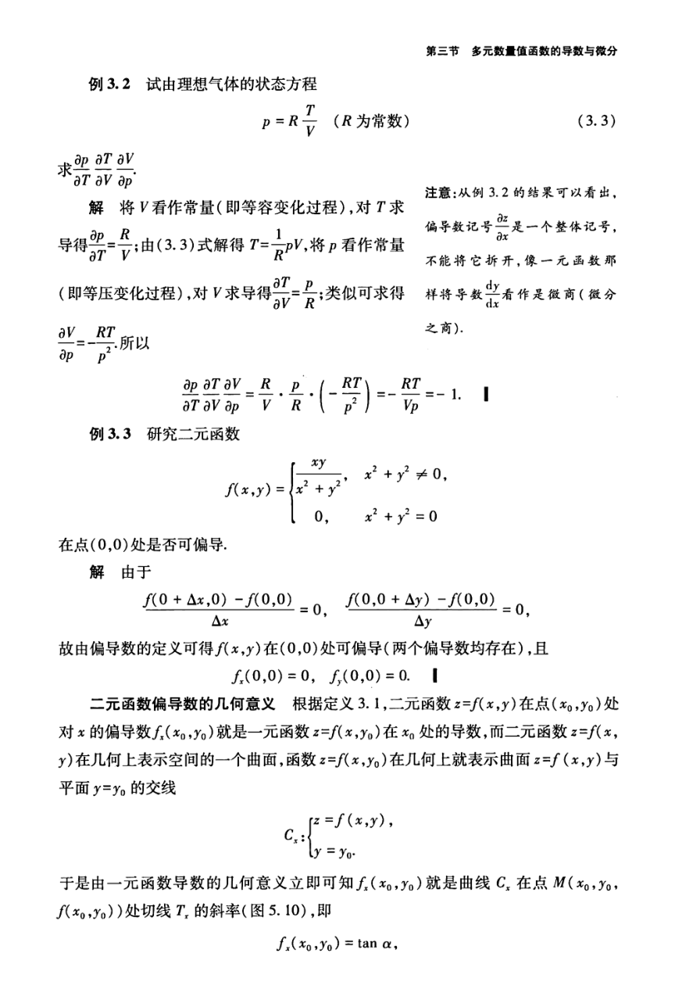

# 工科数学分析基础 下册 - Page 34

- 源文件：`temp/math/工科数学分析基础 下册.pdf`
- PDF 页码：34
- 教材页码：25
- 目录位置：第五章 / 第三节 / 3.1 偏导数
- 页图：`temp/math/visual-latex/工科数学分析基础 下册/pages/page-0034.png`
- 转写方式：视觉阅读 + LaTeX 手工整理
- 状态：已转写

## LaTeX Markdown

**例 3.2** 试由理想气体的状态方程

$$
p=R\frac{T}{V}\qquad(R\ \text{为常数}) \tag{3.3}
$$

求

$$
\frac{\partial p}{\partial T},\qquad
\frac{\partial T}{\partial V},\qquad
\frac{\partial V}{\partial p}.
$$

**解** 将 $V$ 看作常量（即等容变化过程），对 $T$ 求导得

$$
\frac{\partial p}{\partial T}=\frac RV.
$$

由 $(3.3)$ 式解得

$$
T=\frac1R pV.
$$

将 $p$ 看作常量（即等压变化过程），对 $V$ 求导得

$$
\frac{\partial T}{\partial V}=\frac pR.
$$

类似可求得

$$
\frac{\partial V}{\partial p}=-\frac{RT}{p^2}.
$$

所以

$$
\frac{\partial p}{\partial T}
\frac{\partial T}{\partial V}
\frac{\partial V}{\partial p}
=
\frac RV\cdot\frac pR\cdot\left(-\frac{RT}{p^2}\right)
=-\frac{RT}{Vp}
=-1.
$$

**例 3.3** 研究二元函数

$$
f(x,y)=
\begin{cases}
\dfrac{xy}{x^2+y^2}, & x^2+y^2\ne 0,\\
0, & x^2+y^2=0
\end{cases}
$$

在点 $(0,0)$ 处是否可偏导。

**解** 由于

$$
\frac{f(0+\Delta x,0)-f(0,0)}{\Delta x}=0,\qquad
\frac{f(0,0+\Delta y)-f(0,0)}{\Delta y}=0,
$$

故由偏导数的定义可得 $f(x,y)$ 在 $(0,0)$ 处可偏导（两个偏导数均存在），且

$$
f_x(0,0)=0,\qquad f_y(0,0)=0.
$$

**二元函数偏导数的几何意义** 根据定义 3.1，二元函数 $z=f(x,y)$ 在点 $(x_0,y_0)$ 处对 $x$ 的偏导数 $f_x(x_0,y_0)$ 就是一元函数 $z=f(x,y_0)$ 在 $x_0$ 处的导数，而二元函数 $z=f(x,y)$ 在几何上表示空间的一个曲面，函数 $z=f(x,y_0)$ 在几何上就表示曲面 $z=f(x,y)$ 与平面 $y=y_0$ 的交线

$$
C_x:
\begin{cases}
z=f(x,y),\\
y=y_0.
\end{cases}
$$

于是由一元函数导数的几何意义立即可知 $f_x(x_0,y_0)$ 就是曲线 $C_x$ 在点 $M(x_0,y_0,f(x_0,y_0))$ 处切线 $T_x$ 的斜率（图 5.10），即

$$
f_x(x_0,y_0)=\tan\alpha,
$$
