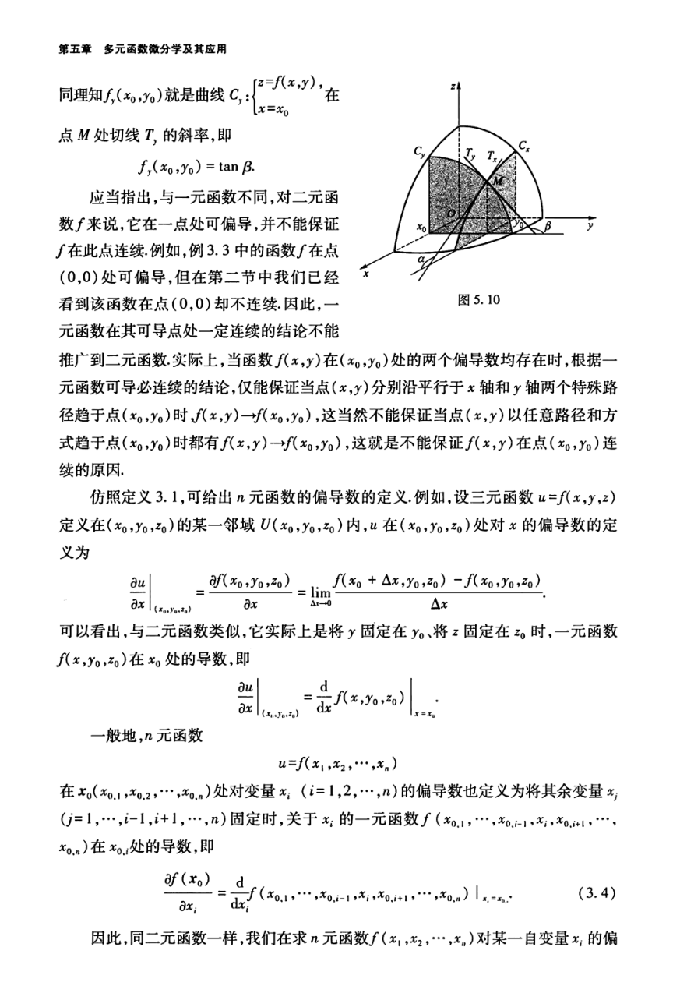

# 工科数学分析基础 下册 - Page 35

- 源文件：`temp/math/工科数学分析基础 下册.pdf`
- PDF 页码：35
- 教材页码：26
- 目录位置：第五章 / 第三节 / 3.1 偏导数
- 页图：`temp/math/visual-latex/工科数学分析基础 下册/pages/page-0035.png`
- 转写方式：视觉阅读 + LaTeX 手工整理
- 状态：已转写

## LaTeX Markdown

同理知 $f_y(x_0,y_0)$ 就是曲线

$$
C_y:
\begin{cases}
z=f(x,y),\\
x=x_0
\end{cases}
$$

在点 $M$ 处切线 $T_y$ 的斜率，即

$$
f_y(x_0,y_0)=\tan\beta.
$$

应当指出，与一元函数不同，对于二元函数 $f$ 来说，它在一点处可偏导，并不能保证 $f$ 在此点连续。例如，例 3.3 中的函数 $f$ 在点 $(0,0)$ 处可偏导，但在第二节中我们已经看到该函数在点 $(0,0)$ 却不连续。因此，一元函数在其可导点处一定连续的结论不能推广到二元函数。实际上，当函数 $f(x,y)$ 在 $(x_0,y_0)$ 处的两个偏导数均存在时，根据一元函数可导必连续的结论，仅能保证当点 $(x,y)$ 分别沿平行于 $x$ 轴和 $y$ 轴两个特殊路径趋于点 $(x_0,y_0)$ 时，

$$
f(x,y)\to f(x_0,y_0),
$$

这当然不能保证当点 $(x,y)$ 以任意路径和方式趋于点 $(x_0,y_0)$ 时都有 $f(x,y)\to f(x_0,y_0)$，这就是不能保证 $f(x,y)$ 在点 $(x_0,y_0)$ 连续的原因。

仿照定义 3.1，可给出 $n$ 元函数的偏导数的定义。例如，设三元函数 $u=f(x,y,z)$ 定义在 $(x_0,y_0,z_0)$ 的某一邻域 $U(x_0,y_0,z_0)$ 内，$u$ 在 $(x_0,y_0,z_0)$ 处对 $x$ 的偏导数的定义为

$$
\left.\frac{\partial u}{\partial x}\right|_{(x_0,y_0,z_0)}
=
\frac{\partial f(x_0,y_0,z_0)}{\partial x}
=
\lim_{\Delta x\to 0}
\frac{f(x_0+\Delta x,y_0,z_0)-f(x_0,y_0,z_0)}{\Delta x}.
$$

可以看出，与二元函数类似，它实际上是将 $y$ 固定在 $y_0$、将 $z$ 固定在 $z_0$ 时，一元函数 $f(x,y_0,z_0)$ 在 $x_0$ 处的导数，即

$$
\left.\frac{\partial u}{\partial x}\right|_{(x_0,y_0,z_0)}
=
\left.
\frac{d}{dx}f(x,y_0,z_0)
\right|_{x=x_0}.
$$

一般地，$n$ 元函数

$$
u=f(x_1,x_2,\cdots,x_n)
$$

在

$$
x_0=(x_{0,1},x_{0,2},\cdots,x_{0,n})
$$

处对变量 $x_i$（$i=1,2,\cdots,n$）的偏导数也定义为将其余变量

$$
x_j\qquad(j=1,\cdots,i-1,i+1,\cdots,n)
$$

固定时，关于 $x_i$ 的一元函数

$$
f(x_{0,1},\cdots,x_{0,i-1},x_i,x_{0,i+1},\cdots,x_{0,n})
$$

在 $x_{0,i}$ 处的导数，即

$$
\frac{\partial f(x_0)}{\partial x_i}
=
\left.
\frac{d}{dx_i}
f(x_{0,1},\cdots,x_{0,i-1},x_i,x_{0,i+1},\cdots,x_{0,n})
\right|_{x_i=x_{0,i}}. \tag{3.4}
$$

因此，同二元函数一样，我们在求 $n$ 元函数 $f(x_1,x_2,\cdots,x_n)$ 对某一自变量 $x_i$ 的偏
