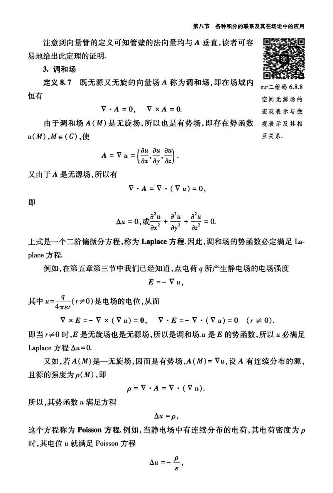

# 工科数学分析基础 下册 - Page 268

- 源文件：`temp/math/工科数学分析基础 下册.pdf`
- 页码：268
- 页图：`temp/math/visual-latex/工科数学分析基础 下册/pages/page-0268.png`
- 转写方式：视觉阅读 + LaTeX 手工整理
- 状态：待转写

## LaTeX Markdown

<!-- 在这里填入视觉转写内容。公式使用 `$...$` 或 `$$...$$`。 -->
